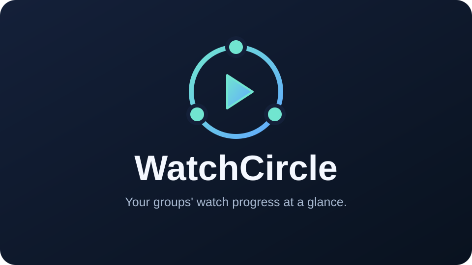

<h1 align="center">Jellyfin WatchCircle</h1>



> [!NOTE]
> WatchCircle is under development. Shared progress cards, automatic group membership and optional Seerr request attribution are available. The inherited Watch together feature remains present; its removal will follow separately.

## About

**WatchCircle** helps household and friend groups see what everyone has already started watching on your Jellyfin server. An admin creates **watch groups**, picks which Jellyfin users belong to each group, and the web client shows buddy avatars on posters plus **one shared progress card** on each item detail page.

Use it to plan the next watch session—or use **Watch together** to record what buddies watched on someone else's device and let them sync that progress to their own account later.

Use it to plan the next watch session: browse a library, open a movie or season, and see who has started what—and how far they are—without guessing.

## Requirements

- Jellyfin **12.0** or later (plugin ABI `12.0.0.0`)
- Administrative access to configure groups
- Jellyfin **web client** for overlays and detail cards

## Installation

WatchCircle test releases are available through [GitHub Releases](https://github.com/romanschenk37/WatchCircle/releases) and Jellyfin's plugin catalog. The catalog contains WatchCircle packages only.

1. Open **Dashboard → Plugins → Manage Repositories** and add a new one:
   - Name: `WatchCircle`
   - URL: `https://raw.githubusercontent.com/romanschenk37/WatchCircle/master/manifest.json`
2. Go back to **Dashboard → Plugins** and filter "All".
3. Select **WatchCircle** and install it.
4. After installation you must restart the server to enable the plugin (**Dashboard → Restart**).

For the first test on Jellyfin 12.1, disable Binge Buddy and refresh the web client after restarting. Runtime verification on a Jellyfin server is still pending.

## How It Works

### Groups

A **group** is a named list of Jellyfin users on your server (for example, “Friday Night Crew” or “Roommates”). Groups are stored in the plugin configuration and managed from the dashboard.

- Any **administrator** can create, manage, or delete groups.
- Each group has a **name** and a set of **members** selected from existing Jellyfin accounts.
- Each group can **automatically add new users**. This is off by default and applies only to Jellyfin accounts created after the setting is saved. Existing users are not added retroactively.
- Turning automatic membership off keeps current members. Manually removed members stay removed when other users join or Jellyfin restarts.
- Members are stored by user ID, not username, so renames on the server do not break membership.
- A user can belong to multiple groups. When overlays are built, members from all of your groups are combined and deduplicated.

Groups do **not** change Jellyfin permissions or libraries. They only define which users WatchCircle treats as your “buddies” for progress display.

Automatic membership listens to Jellyfin's user-created event and saves the new member in the existing group configuration. It does not create a separate user database or collect any watch data. Saving an open group editor preserves users added automatically in the meantime.

### What counts as “started”

For each buddy, WatchCircle reads Jellyfin **user data** for the item (or for any episode in a season). Someone counts as having **started** if any of the following is true:

- Marked as played
- Play count greater than zero
- Partial playback position saved
- A last-played date recorded

Watch history is retroactive—it counts even if someone watched **before** they were added to a group.

Your own account is excluded from the poster overlays and the progress rows. Each other person appears once, even if you share several groups. People without a shared group or without any viewing progress on the title are excluded from the progress rows. If nobody qualifies and there is no Seerr request attribution, the card is hidden.

### Poster overlays

When you browse in the **Jellyfin web client**, WatchCircle adds a small stack of profile avatars to the **top-left** of supported thumbnails:

| Item type | What it shows |
|-----------|----------------|
| **Movies** | Buddies who started that movie |
| **Episodes** | Buddies who started that episode |
| **Seasons** | Buddies who started **any episode** in that season |
| **Shows (series)** | Buddies who started **any episode** in that show |

Display rules:

- Up to **three** avatars are shown; if more buddies qualify, a **+N** badge lists the rest on hover.
- Hover an avatar or the **+N** badge to see names.

Poster overlays require the **web UI**. Mobile and TV apps do not load the injected client script.

### Detail page cards (movies, seasons & series)

On **movie**, **season**, and **series** detail pages, WatchCircle injects a **WatchCircle** section with one shared card for all group mates who have started the title (or any episode in the season or show).

Each person gets one row, ordered by username, with:

- Their **avatar** and **username**
- A status line, for example `45m 3s watched (86%)`, `1h 45m 13s watched (86%)`, or **`Finished`**
- A rounded **coral progress bar**

**Finished** follows Jellyfin’s own played state (someone can finish during credits without being at 100% of the runtime bar). The bar is shown **full** when Jellyfin marks the item as played.

#### Movies

The shared card appears in the primary details area. Progress is based on that movie’s runtime.

#### Seasons

The shared card appears at the **top** of the season view (above the episode list). Each row shows that person’s **highest started episode** in the season and its watch time and percentage. **Episode finished** refers to that episode, not the entire season.

#### Series

The shared card appears on the **series** detail page. Each row shows that person’s furthest started episode across the show (season and episode index, watch time, and percentage). **Episode finished** refers to that episode, not the entire series.

### Seerr request attribution

When enabled, **Requested by** appears above the progress rows and shows everyone who requested the title in Seerr. Requesters do not need to share a WatchCircle group with you or have started watching. The requester list can appear on its own when nobody in your groups has started the title.

- Movies and series are matched by their **TMDB ID** in Jellyfin's metadata, not by title text.
- Each Seerr user appears once, even across several requests. Series list the requested seasons; season and episode pages include only requests for their season.
- Request attribution reads existing requests through the [Seerr API](https://docs.seerr.dev/api/seerr-api/). It does not store request history or add viewing data.
- The API key stays on the Jellyfin server. Only requester IDs, names and season numbers are returned to viewers; email-only accounts use a neutral `Seerr user <id>` label.
- If Seerr is disabled, unavailable, has no stored request, or the title has no TMDB ID, the request information is omitted. Watch progress still works.

To configure it, open **Dashboard → Plugins → WatchCircle → Seerr requests**:

1. Enable **Show who requested this title in Seerr**.
2. Enter the Seerr URL reachable from the Jellyfin server (including any reverse-proxy subpath).
3. Enter the API key from **Seerr → Settings → General**.
4. Click **Save and test connection**.

After saving, the key field stays empty; leaving it blank keeps the saved key. When changing the URL, enter the key again. To remove it, disable the integration and check **Remove the saved API key** before saving.

### Watch together

**Watch together** lets a **host** mark which group buddies are watching on their device. WatchCircle records what was watched on the host’s Jellyfin account; when those buddies sign in later on their own devices, they get a **validation dialog** to copy the progress they care about into their own watch history.

#### Starting a session (host)

1. In the **Jellyfin web client**, start playback on the host account.
2. When prompted, open **Watch together** and select which group buddies are watching on this device.
3. On pause or stop, WatchCircle records movies and episodes watched on the host account.

Only items watched for at least **10 seconds** (or already marked as played) are tracked for buddy sync.

#### Catching up (buddy)

The next time a buddy signs in to the web client, WatchCircle shows a validation dialog for each host they watched with:

- **Host intro** — profile photo, name, and a short message explaining they can confirm what they watched
- **Media list** — items in **watch order** (oldest first)
  - **Movies** appear as selectable cards (thumbnail, title, watch date, progress)
  - **TV shows** are **grouped by series**: series logo over a backdrop header, with **expandable seasons** (only seasons that have episodes to validate). Episodes use the same card layout as movies.
- Buddies check the media they want to keep, then click **Continue** to apply that progress to their Jellyfin account and clear the pending queue for that host.

After validation, the web UI refreshes **poster overlays**, **WatchCircle** detail cards (including pages already open), and Jellyfin’s native progress bars where possible.

#### Watch together rules

- Requires the **web client** on both host and buddy sides.
- Pending items that are no longer in the library (or inaccessible to the buddy) are removed automatically.
- Watch dates in the validation dialog are formatted using the **Jellyfin server culture** (not necessarily the browser language).

## Features

- Create and manage watch groups from the plugin settings page
- Pick members with checkboxes and profile avatars
- Automatically add newly created Jellyfin users to selected groups
- Avatar stacks on **movie**, **episode**, **season**, and **show** posters in the web client
- One **WatchCircle** progress card on **movie**, **season**, and **series** pages
- One row per eligible person with time watched, percentage, and Jellyfin **Finished** state
- Season and series rows show the **highest started episode** and that episode’s progress
- Progress based on each user’s Jellyfin watch state (retroactive)
- **Watch together** — host records shared viewing; buddies validate and sync progress on next login
- Validation UI with host profile, grouped series/seasons, and selective media approval
- Post-validation UI refresh for overlays, detail cards, and library progress bars

## Configuration

1. Sign in to Jellyfin as an administrator.
2. Go to **Dashboard → Plugins → WatchCircle**.
3. **Create a group**
   - Enter a name (for example, `Friday Night Crew`).
   - Click **Create group**.
4. **Configure members**
   - Click **Manage group →** on the group card.
   - Check the Jellyfin users who should be in the group.
   - Optionally enable **Automatically add new users** for future accounts.
   - Click **Save group**.
5. Repeat for any other groups you need.

Each server user who should see overlays and cards must be included in at least one group with the people they watch with. Users who are not in any group with you will not appear on your UI, and you will not appear on theirs.

To remove a group, open it and use **Delete group** (with confirmation).

## Usage

After groups are configured:

1. Sign in to Jellyfin in a **browser**.
2. **Library browsing** — look at poster thumbnails for stacked buddy avatars (movies, episodes, seasons, shows).
3. **Movie details** — open **WatchCircle** for everyone’s progress in one card.
4. **Season details** — **WatchCircle** appears at the top; each row shows one person’s furthest episode and progress.
5. **Series details** — **WatchCircle** shows each person’s furthest episode across the show in the shared card.
6. **Watch together (host)** — when playback starts, choose buddies on this device; their pending sync is updated when you pause or stop.
7. **Watch together (buddy)** — on login, confirm watched media in the validation dialog to update your own progress.

If nothing appears for a title, no other group member has started it yet—or you may be the only one who has.

If overlays or cards do not show up after an update, try a hard refresh (**Ctrl + F5**); the plugin injects UI as Jellyfin renders each view.

## Build

1. Install the [.NET 9 SDK](https://dotnet.microsoft.com/download/dotnet/9.0).
2. From the repository root, build and publish:
   ```bash
   dotnet publish Jellyfin.Plugin.WatchCircle/Jellyfin.Plugin.WatchCircle.csproj --configuration Release --output bin
   ```
3. Create a `WatchCircle` directory inside your Jellyfin plugins folder, copy the published `Jellyfin.Plugin.WatchCircle.dll` into it, and restart the server.

Jellyfin lists the plugin as **WatchCircle**. Its plugin ID is `33f774e1-5cb2-4aca-a349-f6ec2bd82c7f`. WatchCircle uses its own configuration and `/WatchCircle` API routes; existing Binge Buddy group settings are not imported automatically.

Plugin metadata for catalog builds is defined in [`build.yaml`](./build.yaml).

Run the group management and Seerr regression tests with:

```bash
dotnet test tests/WatchCircle.Tests/WatchCircle.Tests.csproj --configuration Release
```

## Publishing a release

Keep the four-part version in `Directory.Build.props` and `build.yaml` in sync, update `RELEASE_NOTES.md`, and commit the changes. Create and push the matching Git tag (for example `v1.0.2.0`). In GitHub Actions, run **Publish WatchCircle** on the default branch and enter that tag. Forks may require enabling Actions first.

The workflow builds the tagged source, uploads a ZIP to a GitHub prerelease, then updates `manifest.json` on the default branch with the download URL and checksum. Existing release assets are never overwritten. GitHub prerelease status labels the release as a test build; Jellyfin users who add this catalog can still install it.

For local packaging after a release build, run `pwsh -File scripts/package-release.ps1 -Tag v1.0.2.0`. The ZIP and catalog preview are written to `artifacts/release/`. Update the public catalog only after the corresponding ZIP has been uploaded successfully.

## Contributing

Contributions, issues, and feature requests are welcome.

1. Fork the repository
2. Create a feature branch (`git checkout -b feature/my-change`)
3. Commit your changes (`git commit -am "Add my change"`)
4. Push to the branch (`git push origin feature/my-change`)
5. Open a pull request

Refer to the [Jellyfin contributing guidelines](https://github.com/jellyfin/.github/blob/master/CONTRIBUTING.md) for more information.

## Credits and license

WatchCircle is a fork of [Binge Buddy by Cyprien-png](https://github.com/Cyprien-png/jellyfin-binge-buddy). The original implementation and Git history are retained. The original screenshots and raster artwork remain in the repository as upstream reference assets; WatchCircle uses `thumbnail.svg` for its branding.

This plugin is licensed under the **GNU General Public License v3.0**. See [LICENSE](./LICENSE) for the full text.
